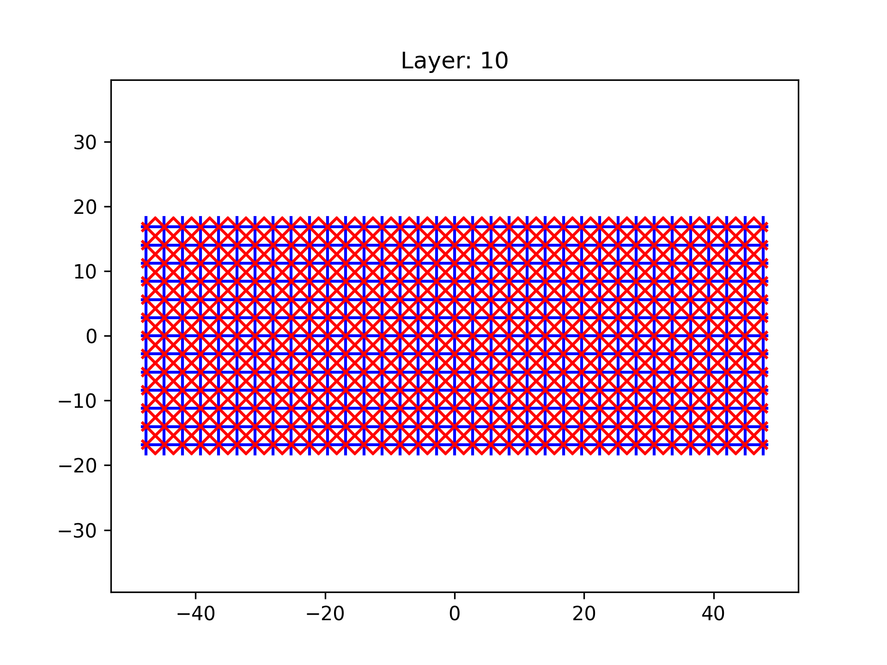
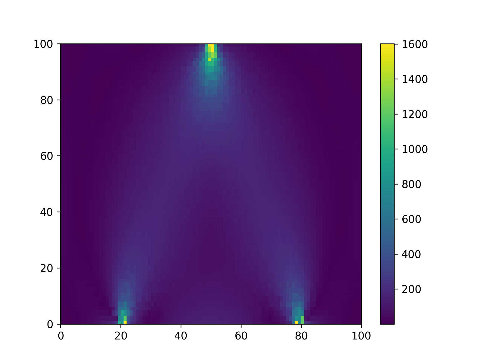
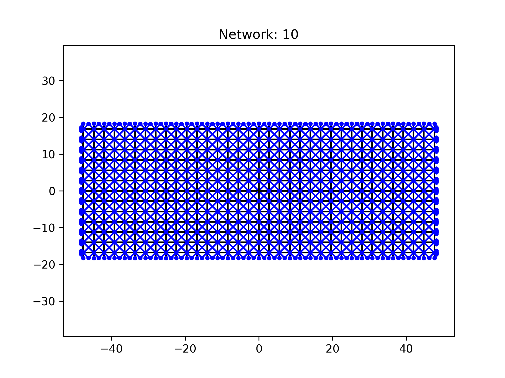
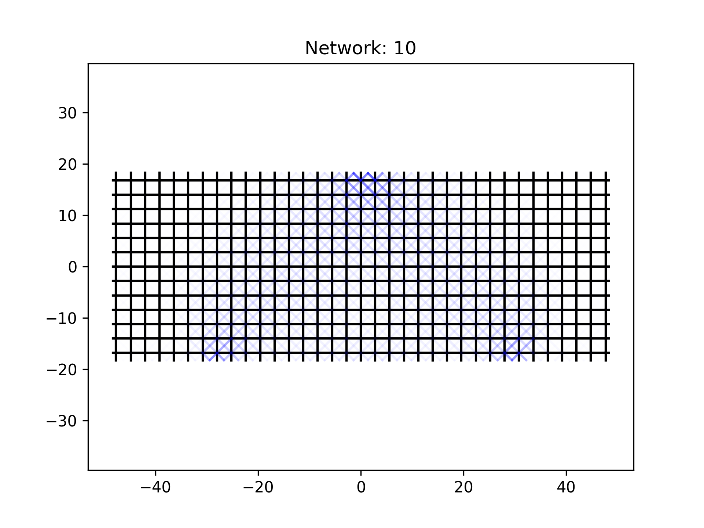
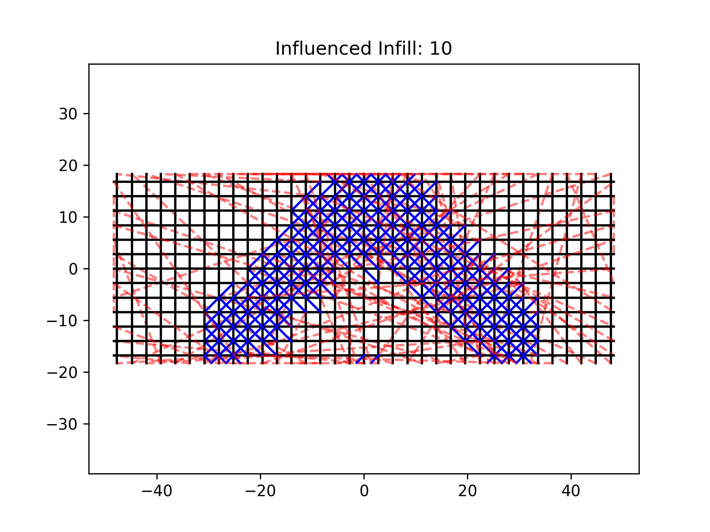

# Infill generator influenced by FEA (or equivalent simulation results)

## Installation

To use this package, you will need to [Slic3r](https://slic3r.org/) installed on your computer and Python 3. Once installed create a folder for your study and `cd` into it and create a virtual environment.

```
python -m venv .venv
```

Activate the environment.

```
source .venv/bin/activate
```

Install the package using:

```
pip install git+https://github.com/jamesgopsill/influenced_infill_py
```

Download and the examples folder and copy the contents into your folder. Your folder should now contain:

```
.venv
data/
example_01.py
```

Now run:

```
python example_01.py
```

The terminal should report a lot of information regarding the steps taken and at the end your folder should contain:

```
.venv
data/
example_01.py
extracted_infill.png
griddata.png
influenced_infill_print_paths.png
network.png
weighted_network.png
```

The images should look like the example plots below.

## Related Papers / Articles

- [J. Gopsill, J. Shindler, and B. Hicks. “Using finite element analysis to influence the infill design of fused deposition modelled parts”. In: Progress in Additive Manufacturing (2017)](https://doi.org/10.1007/s40964-017-0034-y)
- [J. Gopsill and B. Hicks. “Deriving the Infill Design of Fused Deposition Modelled Parts from Predicted Stress Profiles”. In: Proceedings of the ASME 2016 International Design Engineering Technical Conferences and Computers and Information in Engineering Conference. American Society of Mechanical Engineers. 2016](https://doi.org/10.1115/DETC2016-59935)
- [Optimised infill designs using force profiles](https://nbviewer.jupyter.org/github/jamesgopsill/PythonNotebooks/blob/master/FDM%20Force%20Path%20Methods/Optimised%20Infill%20Designs%20using%20Force%20Profiles.ipynb)
- [Influencing the infill of 3D printed components using FEA](https://nbviewer.jupyter.org/github/jamesgopsill/PythonNotebooks/blob/master/FDM%20Force%20Path%20Methods/Generating%20infill%20designs%20based%20on%20forces%20through%20a%20part.ipynb)

## Example plots






